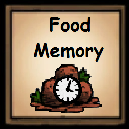

# mod-warly-memory

 
## Overview

Mod for the game [Don't Starve Together][] which is available through the
[Steam Workshop][]. The mod tracks the player's eaten foods and can have a timer for them.

## Configuration

Don't like the default behaviour? Choose your own configuration to match your
needs:

| Configuration            | Default                      | Description                                                                 |
| ------------------------ | ---------------------------- | --------------------------------------------------------------------------- |
| **Time format**          | _Minutes & seconds_          | How should the time format be displayed?                                    |
| **Items per row**        | _7_                          | How many items should be in a single row?                                   |
| **Sort Tiles**           | _True_                       | Should the food tiles be sorted everytime a new food is added?              |
| **Sort Type**            | _Shortest Time_              | How should the food tiles be sorted?                                        |
| **Food Add Sound**       | _Crock Pot Finished Cooking_ | What sound should be played when a unique dish is added to the list?        |
| **Food Remove Sound**    | _Crock Pot Built_            | What sound should be played when a dish is removed from the list?	          |
| **Toggle Food Menu**     | _V_                          | Use a button to open/close the food menu.                                   |
| **Portal Delete Memory** | _True_                       | Should using the portal to switch characters delete the food timers?        |
| **Warly-Only**           | _False_                      | Should the widget only turn on when you're Warly?                           |
| **Time Persistence**     | _False_                      | Should the food time not progress for non-Warly characters?                 |
| **Food Timer**           | _Default_                    | The time the foods will be timed for when consumed.                         | 

## License

Released under the [MIT License](https://opensource.org/licenses/MIT).

[don't starve together]: https://www.klei.com/games/dont-starve-together
[steam workshop]: https://steamcommunity.com/sharedfiles/filedetails/?id=2266744139
